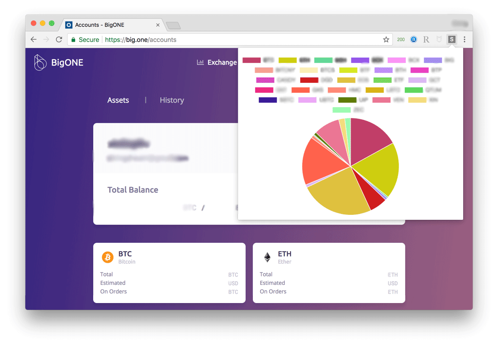

# Small Helper

This is a chrome extension that helps you calculate the proportion of you blockchain assets in BigONE exchange. It doesn't send any data to any server, as all the computing is handled locally.

**This project does not have any relationship with BigONE official. All questions related to this software should be submitted in [github issues](https://github.com/liusining/small-helper/issues).**

## Getting Started

1. Install [this chrome extension](https://chrome.google.com/webstore/detail/small-helper/egbbkoncgnaopedkgpeldfhcgaiejdgp) in chrome web store.
2. Went to your [BigONE account page](https://big.one/accounts).
3. Click the icon (just like the picture above).

## Acknowledgement

1. The `popup/Chart.min.js` is downloaded from [Chart.js](https://github.com/chartjs/Chart.js) project under MIT license.
2. The color codes are generated by using [randomColor.js](https://github.com/davidmerfield/randomColor).
